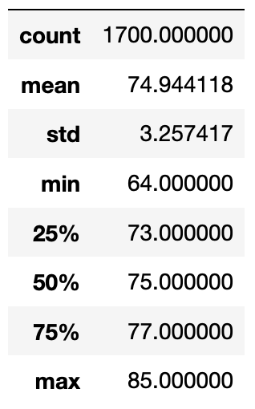
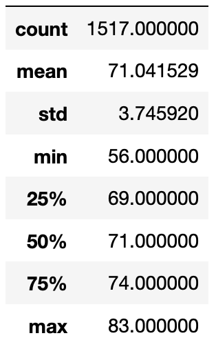
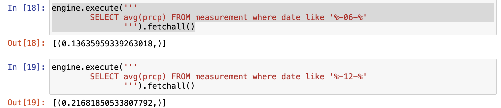
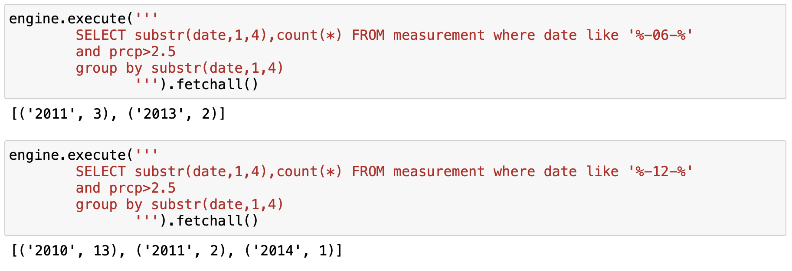

# Surf And Shake Shop Analysis

## Overview of the Project

To start a new business venture serving surfboards and ice cream in Hawaii an initial business plan was put up. One key concern was on the weather. This project is to analyze an available weather dataset to determine the risks and if this idea will be successful.

After looking at different weather factors like precipitation, stations and temperature, things looked good. One final research here is to check the temperature data for the months of June and December in Oahu and perform an analysis on this.

## Resources
- Data Source: hawaii.sqlite
- Software: Python 3.9.7, Jupyter Notebook, flask
---

## Results

Below were the key temperature metrics 

June | December
:-------------------------:|:-------------------------:
|

The three key differences in weather between June and December are as follows:
1. The mininum temperature in december dips far below the temperation in june thats from 64 F in june to 56 F in december.
2. There is a 4 F difference for both the  25th percentile (69 F in december and 73 F in June) and 50th percentile (71 F in december and 75 F in June)
3. At the higher percentile 75th and max, the difference converges with december still being a bit lower with 75th percentile at 74 F in december and 71 F in june. The max temperation at 83 F in december and 85 F in june.
4. The number of datapoints in december is less than june (1517 vs 1700)

---

## Summary

With the temperature above 70 F 50% of the time in december there starting a business in Oahu seems to be very good option.

Few additional queries on weather data was done to confirm on the same for June and December

1. Average precipitation was a bit high in december but at very low numbers

2. Count of days where there was moderate rain over the years (precipitation >2.5) is a very low number.

